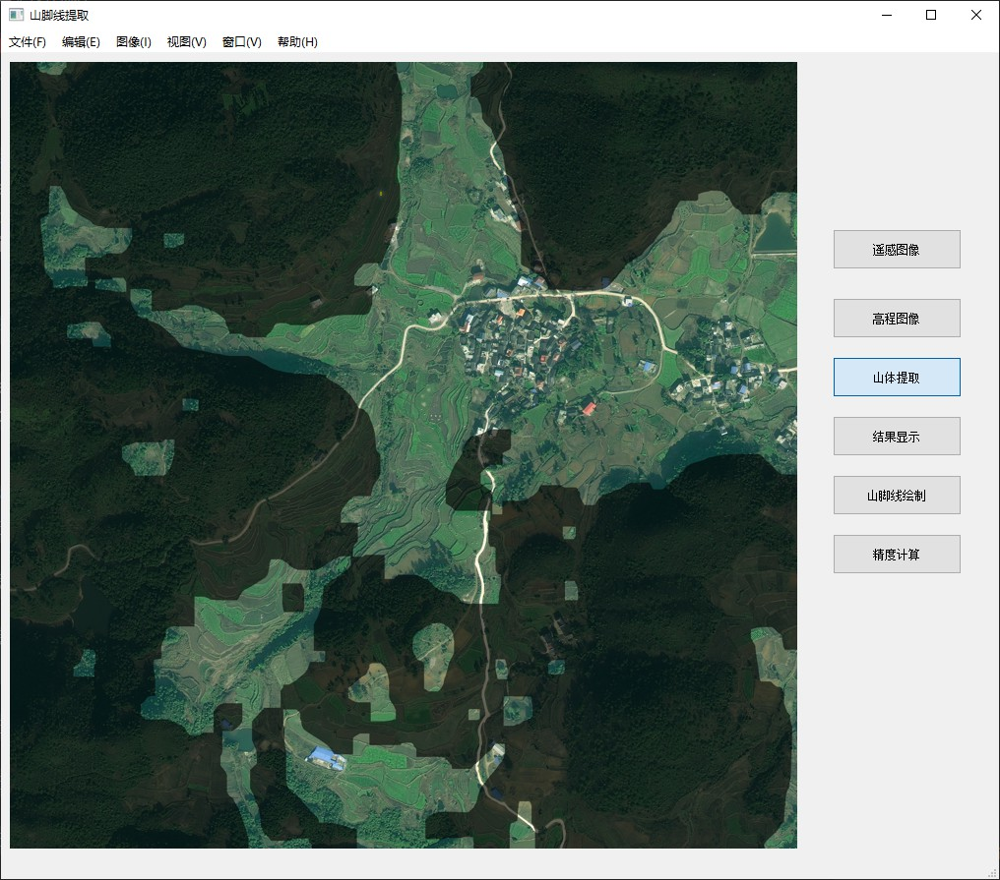

# 村落骨架提取
This is a python project that extract the mountain foot from remote sensing image.

村落选址与山水分析的python图像处理项目

<p align="center">
    
</p>

### 安装Pytorch和其它依赖：
```bash
# Python 3.8.5
pip install opencv-python pillow pyqt5 
```

# 使用

```bash
python main.py
```

# 操作流程
① 点击“文件”->"加载遥感数据"加载遥感图像;  

② 点击“加载高程数据”选择该遥感图像对应的高程文件；  
 
③ 点击山体提取，进行山体提取；  

④ 点击“结果显示”，获取融合结果；  

# 备注
点击“编辑”->“参数设置”可进行参数设置，其中的“提取模式”和“调整模式”有简单  

和复杂两种选择，复杂模式会消耗大量时间，但结果去除了狭长的山地、狭长的平原、  

较小的山地和较小的平原